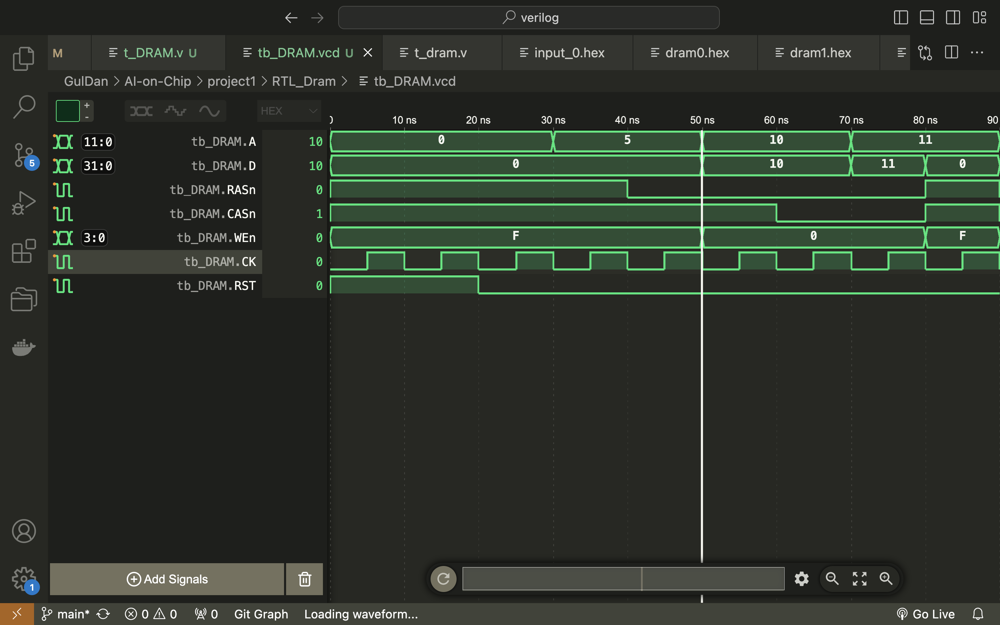
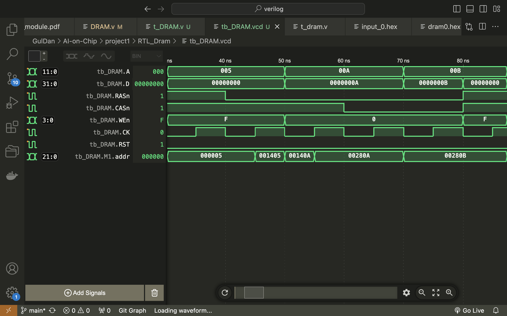
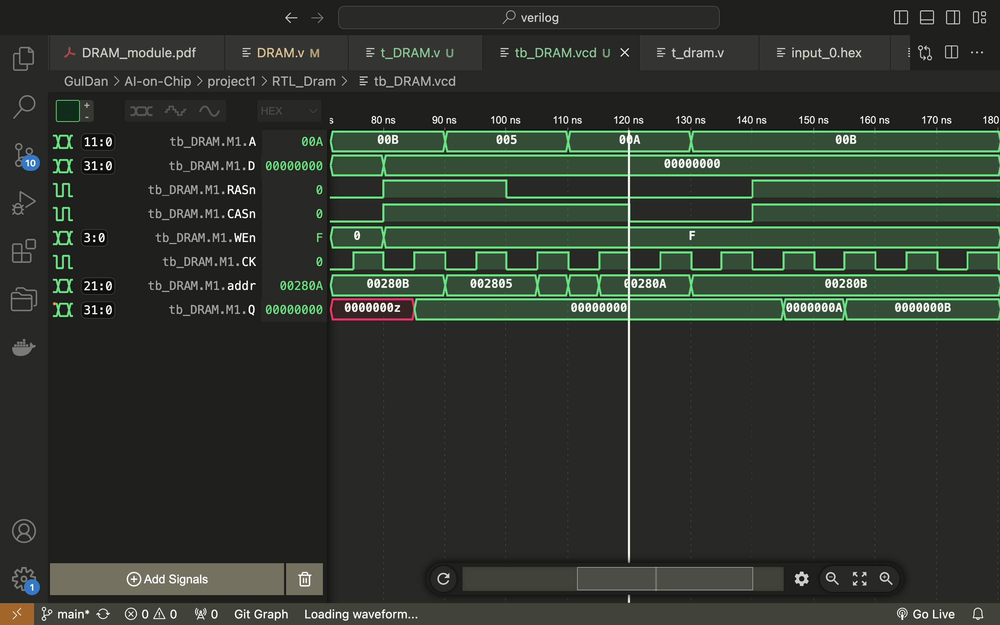
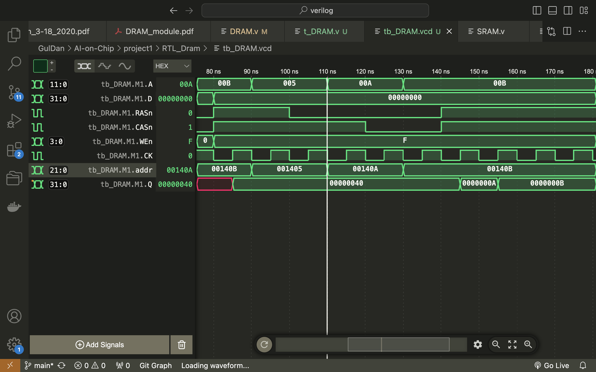

# [AI-on-Chip](https://hackmd.io/ywb6pu-bQzySh-WNBEDyfw)

## Project 1
`.hex` 檔: `.hex` 文件格式指示在指定的地址開始放入後續的數據。這是一種常見的內存初始化文件格式，用於指示數據應該加載到的特定地址。每行的數據按順序加載到內存中，開始於指定的地址。

* image data 共有 519168(416 * 416 * 3) 筆，從 @00000000 到 @0007ec00。最後一段 image data 起始於 @0007c000，共有11264 (704 * 16) 筆 data，結束於 @0007ec00。下一段(weighting data)起始於 @00100000:
```
@0007C000
40 40 40 40 40 40 40 40 40 40 40 40 40 40 40 40 
40 40 40 40 40 40 40 40 40 40 40 40 40 40 40 40 
40 40 40 40 40 40 40 40 40 40 40 40 40 40 40 40
...

@00100000
09 1A 0E 21 EF DF FE C5 F8 0E 17 02 14 E8 DC 03 
D7 03 F0 04 FB 03 01 FA 00 F1 06 E4 F5 35 0D 05 
EA 13 1B EC 09 DA 33 CA 1D ED 35 FE 14 36 1E B7 
...
```


* DRAM 行為
> Write
> RAS=0 -> Set Row (A should be ready)
> CAS=0 -> Set Column(A, WEn and D should be ready)



50ns ~ 80ns 時，WEn 為 0x0，代表可以寫入，這時拉低 RAS 和 CAS 可以指定寫入位置。



而寫入的位置為:

```verilog
...
assign addr = {row_l, A[9:0]};
...
if ((~RASn)&&(CASn)) row_l <= A[row_size-1:0];
...
```

A 為 Address，D 為 Data。
此時 [A, D] 為 [0xA, 0xA](60ns 時), [0xB, 0xB](70ns 時)。
依照 `addr = {row_l, A[9:0]}`，實際寫入位置為 {A[11:0], A[9:0]}，即 {12'b000000001010, 10'b0000001010} 和 {12'b000000001011, 10'b0000001011}，即 0x280A 和 0x280B。
可以看到在 0x280A 和 0x280B 分別寫入 0xA 和 0xB 的值:
```
00002800: 00000000
00002801: 00000000
00002802: 00000000
00002803: 00000000
00002804: 00000000
00002805: 00000000
00002806: 00000000
00002807: 00000000
00002808: 00000000
00002809: 00000000
0000280a: 0000000a
0000280b: 0000000b
0000280c: 00000000
0000280d: 00000000
0000280e: 00000000
0000280f: 00000000
00002810: 00000000
00002811: 00000000
00002812: 00000000
00002813: 00000000
```

> Read
> RAS=0 -> Set Row (A should be ready)
> CAS=0 -> Set Column(A, WEn should be ready)
> Latency : 2 cycle



在 120ns 時，CASn 隨著 RASn 一起拉低，且 WEn 也為 0xF 時，可以開始讀值 (DRAM 輸出)，讀的位址為 0x280A 和 0x280B，經過兩個 cycle(因為 CL_BF1、CL_BF2)後，讀到的值為 0xA、0xB。



經過修正，要加一支 `update_row` 來確認 row 已經 update 的話就不要再更新，因為我們要讀取的位址是 0x140A 跟 0x140B。否則在 110ns 時，A 為 0xA 時，row 的值會被更新為 0xA，讀取的位址就會變成 0x280A 跟 0x280B。

```verilog
#(`CYCLE) A = 5; // Row Address
#(`CYCLE) RASn = 0;
#(`CYCLE) A = 10; WEn = 4'b0000; D = 10; // Column Address
#(`CYCLE) CASn = 0;
#(`CYCLE) A = 11; D = 11; // Column Address
```